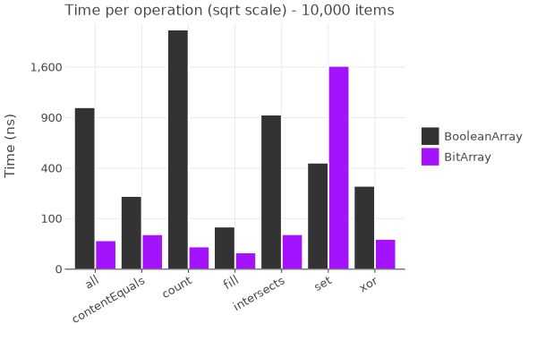
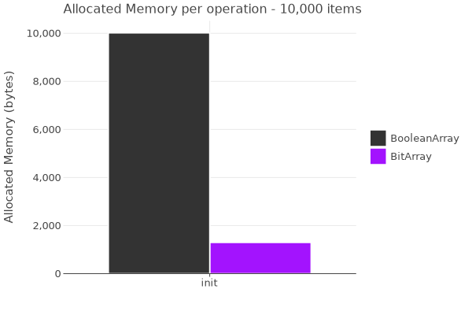
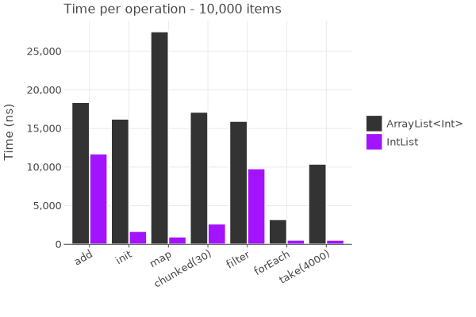
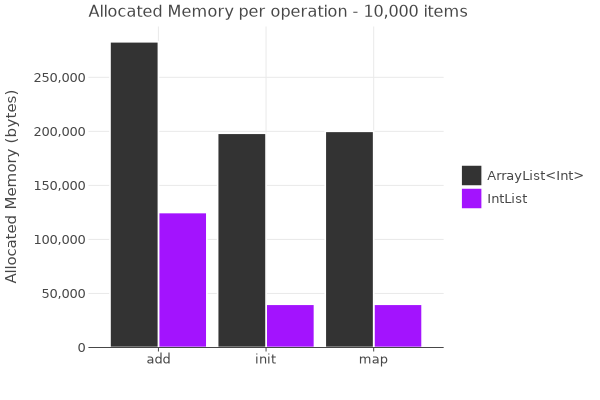
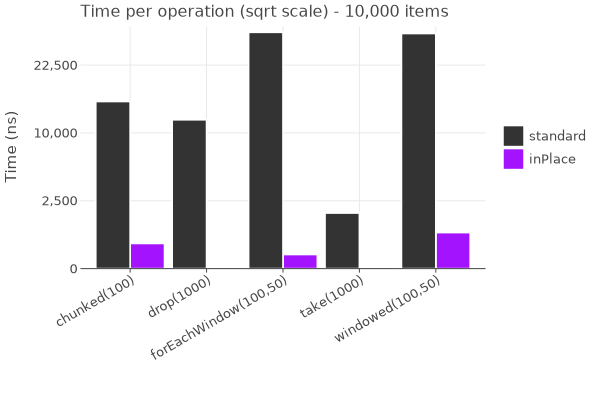
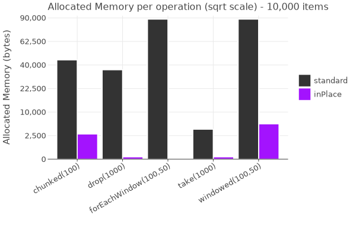
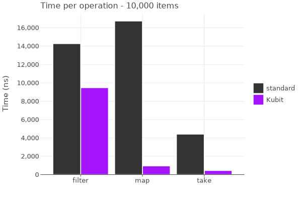
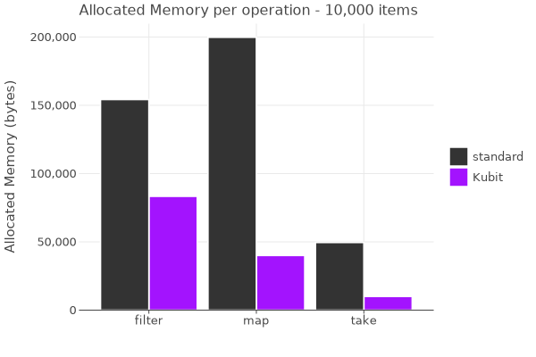

# Benchmarks

This document provides performance benchmarks for key functions in the library, comparing optimized
versions with their standard counterparts.

---

> [!NOTE]
> - All benchmarks were run on an Apple M4 Pro MacBook Pro with 24GB of RAM using JMH (Java Microbenchmark Harness).
> - Results may vary depending on the hardware and software environment.
> - To run the benchmark on your device, use the `./gradlew :benchmark:main` command and it will update the graphs in this file when it finishes
> - To read the exact numbers check the [/processed](benchmark/src/main/java/benchmark/reporting/processed) folder in the benchmark module.
> - The benchmarks below are not exhaustive and do not cover all functions in the library. They are
    intended to provide a general idea of the performance improvements offered by the optimized
    versions.
> - Contributions or suggestions to improve the accuracy of the benchmarks and their results are welcome.
    
---

## BitArray
`BitArray` packs bits and applies word‑level bitwise ops, so bulk ops (count, all, xor ...etc) are dramatically faster;
random per‑index `set` can be slower.

`BitArray` stores 8 bits per byte (~8x+ smaller than `BooleanArray`), minimizing allocations—ideal for huge boolean sets or memory‑bound workloads.

## Primitive Lists
Primitive Lists uses contiguous, unboxed primitives with pre‑sized results and index‑based loops (no boxing/iterators),
making ops like map/forEach/chunked much faster for numeric pipelines.

Primitive Lists stores primitives contiguously with far fewer allocations and memory usage than generic `List`.

## InPlace Ext
In‑place variants reuse the source list and index ranges, avoiding intermediate collections. best for large sliding windows, chunking, and scans.

Near‑zero allocations by eliminating intermediate lists; ideal for streaming/windowed processing under tight memory.

## Array Ext
Primitive array ops are index‑based over primitives with pre‑sized outputs and direct `copyInto`, avoiding boxing, iterators, and extra bounds checks—ideal for large map/filter/take.

Preallocates exact‑size primitive buffers and writes directly (no intermediate lists), significantly lowering allocation and GC overhead.

